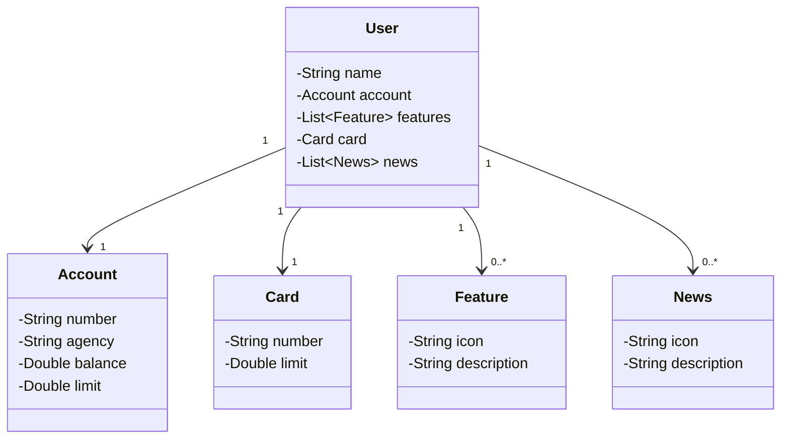

## Projeto Banco Legal

### Olá! Vamos aprender sobre o Banco Legal!

Imagine que você tem um cofrinho mágico onde guarda seu dinheiro. Esse projeto é como um cofrinho mágico, mas é um banco de verdade! Vamos conhecer cada pedacinho dele.

### Personagens Principais

#### 1. Usuário (User)
O Usuário é você! É quem tem a conta no banco. O Usuário tem várias coisas legais no banco:

- **Nome**: O seu nome.
- **Conta**: Sua conta no banco, onde guarda o dinheiro.
- **Características**: Coisas especiais que seu banco tem.
- **Cartão**: Um cartão mágico para comprar coisas.
- **Notícias**: Novidades e notícias do banco.

#### 2. Conta (Account)
A Conta é onde seu dinheiro fica guardado. Na Conta, temos:

- **Número da Conta**: Um número especial só para sua conta.
- **Agência**: Outro número que diz em qual agência do banco sua conta está.
- **Saldo**: Quanto dinheiro você tem.
- **Limite**: Quanto você pode gastar além do que tem (tipo um dinheiro emprestado).

#### 3. Característica (Feature)
As Características são coisas legais que o banco oferece. Cada Característica tem:

- **Ícone**: Uma imagem que representa a característica.
- **Descrição**: Uma explicação sobre o que é essa característica.

#### 4. Cartão (Card)
O Cartão é como uma varinha mágica que você usa para comprar coisas. Ele tem:

- **Número do Cartão**: Um número só para seu cartão.
- **Limite**: Quanto você pode gastar com o cartão.

#### 5. Notícia (News)
As Notícias são novidades do banco. Cada Notícia tem:

- **Ícone**: Uma imagem que representa a notícia.
- **Descrição**: Uma explicação sobre a novidade.

### Como tudo isso se conecta?

Imagine que tudo isso é como uma grande festa de aniversário:

- **Você (Usuário)** é o aniversariante.
- **A Conta** é onde você guarda seus presentes (dinheiro).
- **As Características** são como brincadeiras e jogos que você pode aproveitar.
- **O Cartão** é uma varinha mágica que você usa para comprar brinquedos.
- **As Notícias** são como as surpresas e novidades da festa.

### Desenho do Cofrinho Mágico

Aqui está um desenho simples para mostrar como tudo isso está conectado:

### Conclusão

E é isso! Agora você sabe tudo sobre o Banco Legal. Você é o dono da conta, pode usar seu cartão mágico para comprar coisas legais, aproveitar as características especiais do banco e ficar por dentro das últimas novidades. Divirta-se com seu cofrinho mágico! 🎉