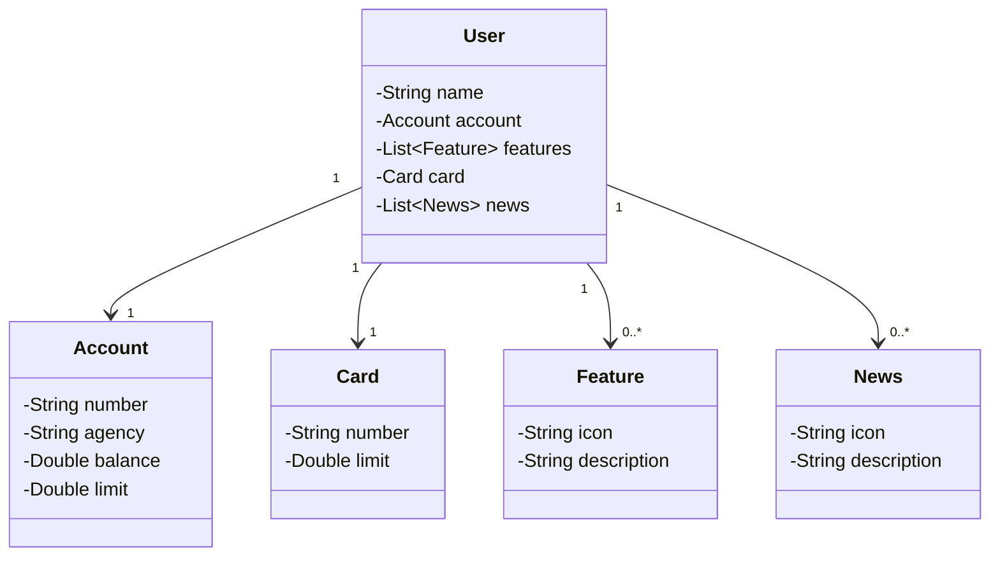

## Projeto Banco Legal

### Olá! Vamos aprender sobre o Banco Legal!

Imagine que você tem um cofrinho mágico onde guarda seu dinheiro. Esse projeto é como um cofrinho mágico, mas é um banco de verdade! Vamos conhecer cada pedacinho dele.

### Personagens Principais

#### 1. Usuário (User)
O Usuário é você! É quem tem a conta no banco. O Usuário tem várias coisas legais no banco:

- **Nome**: O seu nome.
- **Conta**: Sua conta no banco, onde guarda o dinheiro.
- **Características**: Coisas especiais que seu banco tem.
- **Cartão**: Um cartão mágico para comprar coisas.
- **Notícias**: Novidades e notícias do banco.

#### 2. Conta (Account)
A Conta é onde seu dinheiro fica guardado. Na Conta, temos:

- **Número da Conta**: Um número especial só para sua conta.
- **Agência**: Outro número que diz em qual agência do banco sua conta está.
- **Saldo**: Quanto dinheiro você tem.
- **Limite**: Quanto você pode gastar além do que tem (tipo um dinheiro emprestado).

#### 3. Característica (Feature)
As Características são coisas legais que o banco oferece. Cada Característica tem:

- **Ícone**: Uma imagem que representa a característica.
- **Descrição**: Uma explicação sobre o que é essa característica.

#### 4. Cartão (Card)
O Cartão é como uma varinha mágica que você usa para comprar coisas. Ele tem:

- **Número do Cartão**: Um número só para seu cartão.
- **Limite**: Quanto você pode gastar com o cartão.

#### 5. Notícia (News)
As Notícias são novidades do banco. Cada Notícia tem:

- **Ícone**: Uma imagem que representa a notícia.
- **Descrição**: Uma explicação sobre a novidade.

### Como tudo isso se conecta?

Imagine que tudo isso é como uma grande festa de aniversário:

- **Você (Usuário)** é o aniversariante.
- **A Conta** é onde você guarda seus presentes (dinheiro).
- **As Características** são como brincadeiras e jogos que você pode aproveitar.
- **O Cartão** é uma varinha mágica que você usa para comprar brinquedos.
- **As Notícias** são como as surpresas e novidades da festa.

## [Link do Figma](https://www.figma.com/file/0ZsjwjsYlYd3timxqMWlbj/SANTANDER---Projeto-Web%2FMobile?type=design&node-id=1421%3A432&mode=design&t=6dPQuerScEQH0zAn-1)

O Figma foi utilizado para a abstração do domínio desta API, sendo útil na análise e projeto da solução.

Claro! Vou explicar cada parte desse código JSON:

### Estrutura do JSON

{
  "name": "Nome",
  "account": {
    "number": "00000000-0",
    "agency": "0000",
    "balance": 1324.64,
    "limit": 1000.00
  },
  "features": [
    {
      "icon": "URL",
      "description": "Descrição da Feature"
    }
  ],
  "card": {
    "number": "xxxx xxxx xxxx 0000",
    "limit": 1000.00
  },
  "news": [
    {
      "icon": "URL",
      "description": "Descrição da Novidade"
    }
  ]
}


O JSON fornecido representa informações de uma conta bancária, características do banco, um cartão associado e notícias. Aqui está a explicação detalhada:

1. **name**: O nome do titular da conta.
   ```json
   "name": "Nome"
   ```
   - **"name"**: Chave que identifica o nome do titular da conta.
   - **"Nome"**: Valor representando o nome do titular da conta.

2. **account**: Um objeto que contém detalhes sobre a conta bancária.
   ```json
   "account": {
     "number": "00000000-0",
     "agency": "0000",
     "balance": 1324.64,
     "limit": 1000.00
   }
   ```
   - **"number"**: Número da conta.
   - **"agency"**: Número da agência.
   - **"balance"**: Saldo atual da conta.
   - **"limit"**: Limite de crédito da conta.

3. **features**: Uma lista de objetos que descrevem as características associadas à conta.
   ```json
   "features": [
     {
       "icon": "URL",
       "description": "Descrição da Feature"
     }
   ]
   ```
   - **"icon"**: URL de um ícone que representa a característica.
   - **"description"**: Descrição da característica.

4. **card**: Informações sobre o cartão bancário associado à conta.
   ```json
   "card": {
     "number": "xxxx xxxx xxxx 0000",
     "limit": 1000.00
   }
   ```
   - **"number"**: Número do cartão (parcialmente oculto por razões de segurança).
   - **"limit"**: Limite de crédito do cartão.

5. **news**: Uma lista de objetos que descrevem notícias ou novidades relacionadas à conta.
   ```json
   "news": [
     {
       "icon": "URL",
       "description": "Descrição da Novidade"
     }
   ]
   ```
   - **"icon"**: URL de um ícone que representa a notícia.
   - **"description"**: Descrição da novidade.

### Resumo

- **name**: O nome do titular da conta.
- **account**: Detalhes da conta bancária (número da conta, agência, saldo, limite).
- **features**: Características associadas à conta, cada uma com um ícone e uma descrição.
- **card**: Informações sobre o cartão bancário, incluindo o número (parcialmente oculto) e o limite.
- **news**: Notícias ou novidades relacionadas à conta, cada uma com um ícone e uma descrição.

Esse formato JSON é útil para estruturar e organizar informações de forma que possam ser facilmente manipuladas e exibidas em uma aplicação bancária ou financeira. Se precisar de mais detalhes ou de alguma modificação específica, é só avisar!

### Desenho do Cofrinho Mágico

Aqui está um desenho simples para mostrar como tudo isso está conectado:



### Conclusão

E é isso! Agora você sabe tudo sobre o Banco Legal. Você é o dono da conta, pode usar seu cartão mágico para comprar coisas legais, aproveitar as características especiais do banco e ficar por dentro das últimas novidades. Divirta-se com seu cofrinho mágico! 🎉